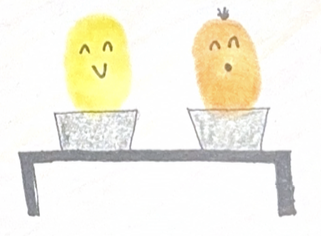

{fig-alt="A comic of two fingerprints, one yellow and one orange, sitting at a desk next to each other. The fingerprints represent students in a classroom. Each fingerprint has a laptop in front of them. The yellow fingerprint is smiling and the orange fingerprint is saying something with a smile on their face."}

