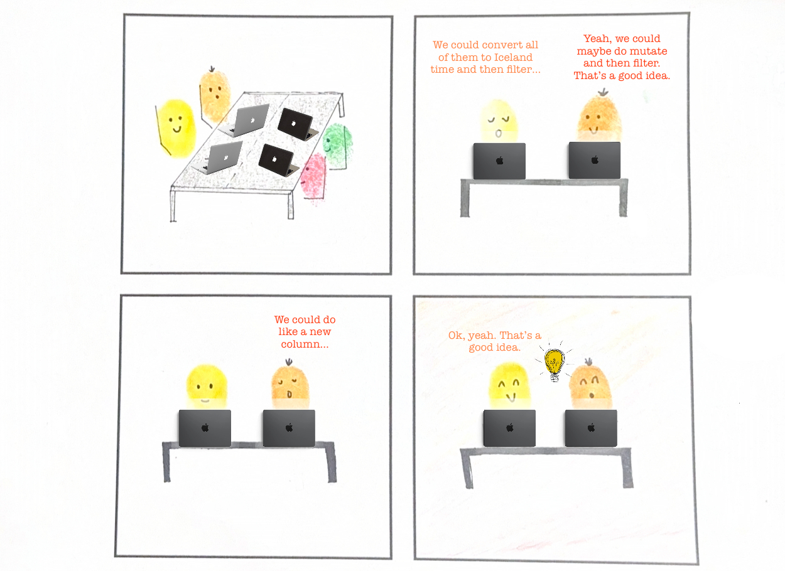
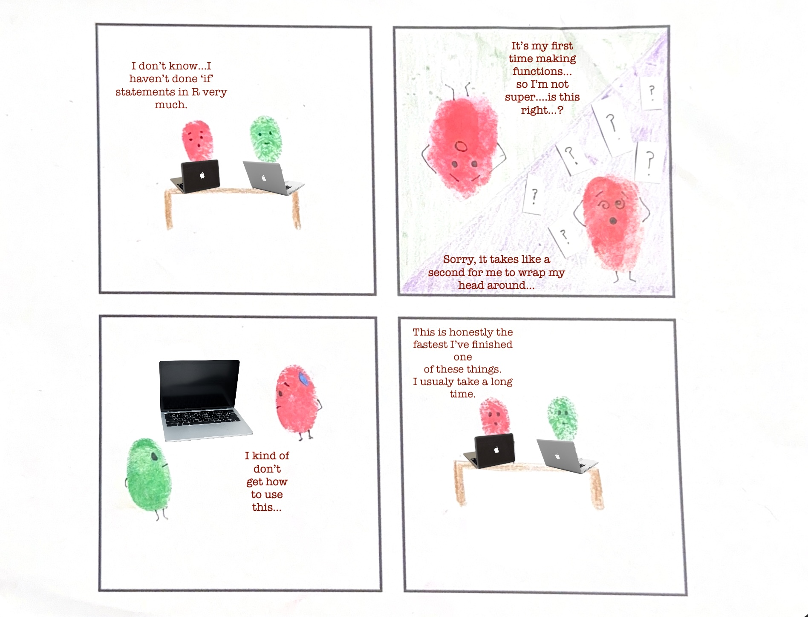
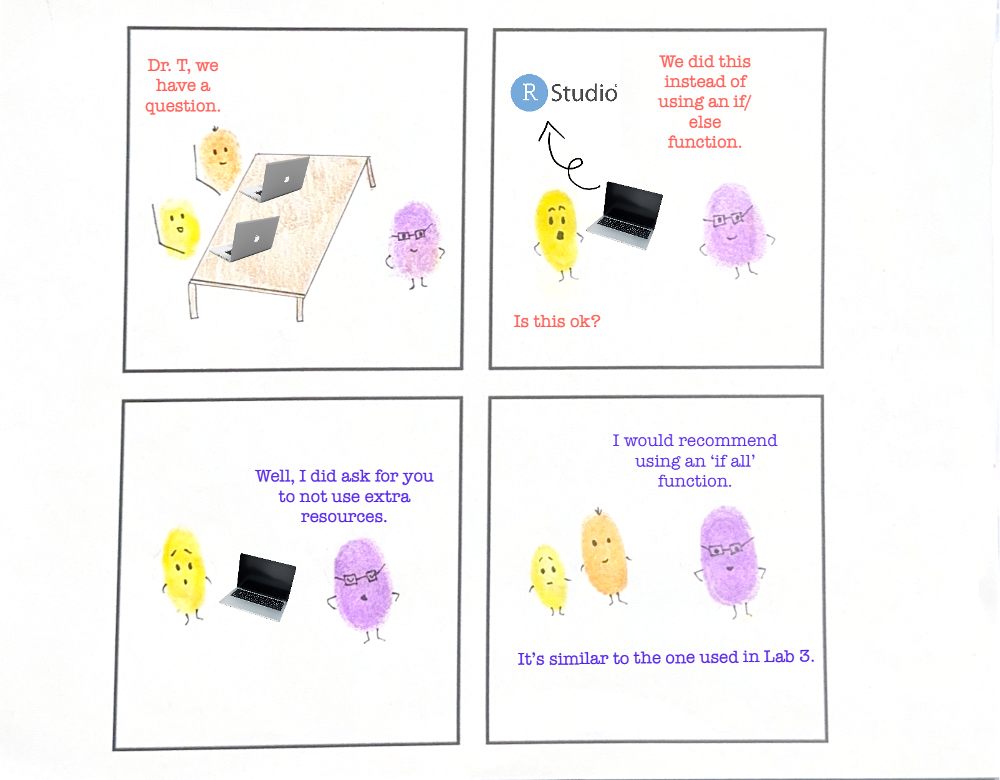

<!-- This is the homepage for displaying the comics you made and connecting them with  -->

<!-- the research! -->

## Ansel & Wren: *Reciprocal Praise*

This interaction begins with Wren (yellow) making a proposal (*“We could convert all of them to Iceland time and then filter...”*). Ansel (orange) accepts this proposal and refines it, suggesting, *“Yeah, we could maybe do mutate and then filter.”* He then praises Wren by saying, *“That’s a good idea.”* Soon after, Ansel proposes, *“We could do like a new column...”* to which Wren responds, *“Ok, yeah. That’s a good idea.”* Both Ansel and Wren benefited from this interaction, as their ideas were reciprocally met with acknowledgment and praise. As seen in the last panel of the comic, Ansel and Wren are smiling, exemplifying how positive language shapes more equitable collaborations.   

## Camilla & Elliott: *Self-Doubt*

{fig-align="center" width="1250"}

In this interaction, Camila (red) and Elliot (green) are working together on a function-writing activity. Throughout the activity, Camila constantly undersells herself and expresses uncertainty about writing functions (*“Sorry, it takes like a second for me to wrap my head around...”*). This underscores the importance of instructors incorporating tasks that draw on multiple knowledge bases, as students may feel insecure when they don’t know what to do. For instance, adding one or two tasks that didn't require writing functions may have helped Camila’s confidence in her ability to complete the activity. Self-doubt is important to address in the classroom, as students are likely to develop a fixed mindset, viewing their failure to understand a certain concept as proof of a lack of ability.

## Ansel & Wren: *Bearing the Brunt*

While stuck on a question, Ansel (orange) and Wren (yellow) decided to ask Dr. T (purple) if their method was sufficient, with Wren being the one to say, *“We did this instead of using an if/else function, is this ok?”* Dr. T directly addresses her, saying, *“Well, I did ask for you to not use extra resources.”* Although their code was a mutual effort, Wren seemed to bear the brunt of their mistake. As a result, Wren might have been put in a position of blame for not following the instructions, which may shape her future instances when seeking an instructor’s help. Wren is seen shrinking in the last panel to convey the negative impact she felt after this interaction with Dr. T. This comic illustrates how student-instructor interactions can worsen learning experiences within the classroom and how language plays a role in maintaining equity. 

## Ansel & Griffin: *Intentionality vs. Impact* 

{fig-align="center"}

In this interaction, Ansel (orange) asks Griffin (blue) if he has done any programming in SQL. Griffin states that he has only a little experience in SQL and that he wants to get better at it. Ansel states that he learned SQL (specifically the SQL 50 Questions LeetCode study plan) during his summer internship in his free time. He goes on to say, *“They’re kind of fun, honestly...it’s like little puzzles.”* Although Ansel was probably well-intentioned during this interaction, he positions himself with intellectual authority as he describes his knowledge of SQL that Griffin doesn’t have. As a result, Ansel could have been inclined to take control of the activity, while Griffin could have felt reliant on Ansel due to his lack of SQL experience. This interaction shows how seemingly ordinary conversations can impact someone’s perception of themselves or others, no matter how well-intended they may be. At the end of the comic, Griffin shrinks in size, symbolizing his loss of authority.   

## Camila & Elliot: *“Wait, what happened?”* 

{fig-align="center"}

Both Elliot (green) and Camila (red) were having trouble running the code. Without asking Camila’s permission to seek additional help, Elliot turns to their classmate (purple) and says, *“Do you mind if we look at your last step?*” Elliot and the classmate start discussing the issue while leaving Camila out. Camila had to ask him, *“Wait, what happened?”* Camila is left questioning, despite being Elliot’s partner. In the third panel of the comic, Camila is not pictured at all, representing her invisibility in this interaction, and in the final panel, she has substantially shrunk in presence. This interaction shows that students who seek outside help or clarification may position their partner with lower merit and authority, assuming their partner doesn't know the answer. Instead of immediately asking their classmate for help, Elliot should’ve first checked whether Camila had any other solutions to the problem. If she didn’t, then he could ask their classmates for help (after getting permission from Camila). 
